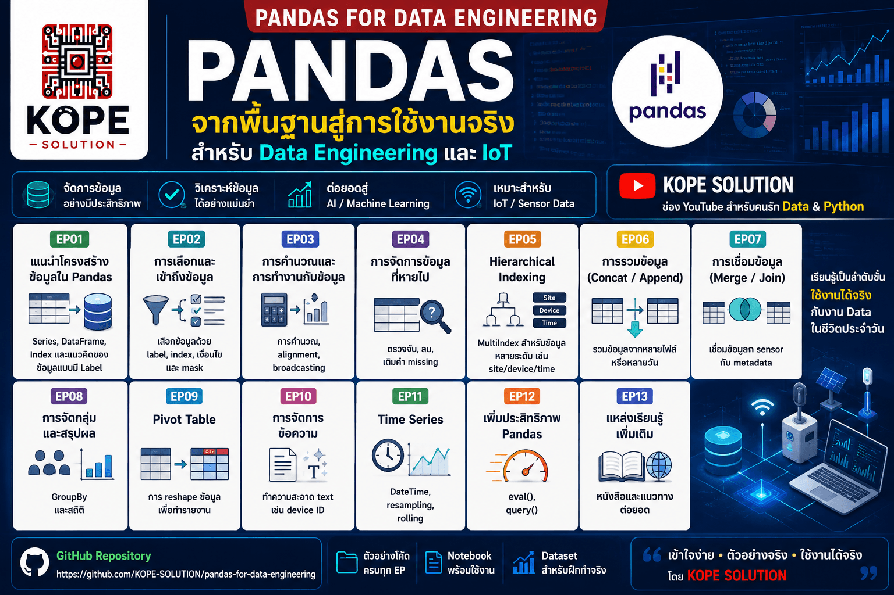

# pandas-for-data-engineering

> เรียนรู้ Pandas สำหรับการวิเคราะห์ข้อมูล, Time-Series และโปรเจกต์จริง (IoT / AI) แบบทีละขั้นตอน พร้อมตัวอย่างใช้งานจริง



## เกี่ยวกับ Repository นี้

Repository นี้ถูกออกแบบมาเป็น ชุดการเรียนรู้สำหรับผู้เริ่มต้น ที่ต้องการใช้ Pandas เป็นเครื่องมือจัดการข้อมูลในงานจริง โดยเฉพาะข้อมูลด้านวิศวกรรม เช่น:
- ข้อมูลจาก Sensor (IoT)
- Log เครื่องจักร
- ระบบพลังงาน
- ข้อมูล Monitoring
- Dataset สำหรับ AI

<br>

เป้าหมายไม่ใช่แค่ “เขียนโค้ดได้” แต่ต้องเข้าใจว่า:
- ข้อมูลมีโครงสร้างอย่างไร
- วิธีทำความสะอาดข้อมูล
- วิธีเลือก (Select) และกรอง (Filter)
- วิธีแปลง (Transform)
- วิธีรวมข้อมูล (Combine)
- วิธีสรุปผล (Aggregate)
- และการเตรียมข้อมูลเพื่อใช้กับ Dashboard หรือ Machine Learning

<br>

ตัวอย่างทั้งหมดออกแบบให้สามารถรันได้บน:
- WSL Ubuntu
- Python 3
- Jupyter Notebook หรือ VS Code
- Pandas, NumPy, Matplotlib

> หมายเหตุ: ตัวอย่างทั้งหมดใช้ข้อมูลทั่วไป เช่น IoT Sensor, สภาพอากาศ, พลังงาน, หรือข้อมูลธุรกิจพื้นฐาน โดยไม่มีการใช้ข้อมูลที่เป็นความลับ

---

## แผนการเรียนรู้: 13 ตอน (Episodes)

|   EP | หัวข้อ                         | โฟลเดอร์                                           | สิ่งที่จะได้เรียนรู้                                   |
| ---: | ------------------------------ | -------------------------------------------------- | ------------------------------------------------------ |
|  EP1 | [แนะนำโครงสร้างข้อมูลใน Pandas](episodes/ep01-introducing-pandas-objects/README.md)  | [`episodes/ep01-introducing-pandas-objects`](episodes/ep01-introducing-pandas-objects/README.md)         | Series, DataFrame, Index และแนวคิดของข้อมูลแบบมี Label |
|  EP2 | [การเลือกและเข้าถึงข้อมูล](episodes/ep02-data-indexing-and-selection/README.md)       | [`episodes/ep02-data-indexing-and-selection`](episodes/ep02-data-indexing-and-selection/README.md)        | เลือกข้อมูลด้วย label, index, เงื่อนไข และ mask        |
|  EP3 | [การคำนวณและการทำงานกับข้อมูล](episodes/ep03-operating-on-data-in-pandas/README.md)   | [`episodes/ep03-operating-on-data-in-pandas`](episodes/ep03-operating-on-data-in-pandas/README.md)        | การคำนวณ, alignment, broadcasting                      |
|  EP4 | การจัดการข้อมูลที่หายไป        | `episodes/ep04-handling-missing-data`              | ตรวจจับ, ลบ, เติมค่า missing                           |
|  EP5 | Hierarchical Indexing          | `episodes/ep05-hierarchical-indexing`              | MultiIndex สำหรับข้อมูลหลายระดับ เช่น site/device/time |
|  EP6 | การรวมข้อมูล (Concat / Append) | `episodes/ep06-combining-datasets-concat-append`   | รวมข้อมูลจากหลายไฟล์หรือหลายวัน                        |
|  EP7 | การเชื่อมข้อมูล (Merge / Join) | `episodes/ep07-combining-datasets-merge-join`      | เชื่อมข้อมูล sensor กับ metadata                       |
|  EP8 | การจัดกลุ่มและสรุปผล           | `episodes/ep08-aggregation-and-grouping`           | GroupBy และสถิติ                                       |
|  EP9 | Pivot Table                    | `episodes/ep09-pivot-tables`                       | การ reshape ข้อมูลเพื่อทำรายงาน                        |
| EP10 | การจัดการข้อความ               | `episodes/ep10-vectorized-string-operations`       | ทำความสะอาด text เช่น device ID                        |
| EP11 | Time Series                    | `episodes/ep11-working-with-time-series`           | DateTime, resampling, rolling                          |
| EP12 | เพิ่มประสิทธิภาพ Pandas        | `episodes/ep12-high-performance-pandas-eval-query` | eval(), query()                                        |
| EP13 | แหล่งเรียนรู้เพิ่มเติม         | `episodes/ep13-further-resources`                  | หนังสือและแนวทางต่อยอด                                 |

---


## การติดตั้งบน WSL Ubuntu

```bash
# 1) อัปเดตระบบ
sudo apt update && sudo apt upgrade -y

# 2) ติดตั้ง Python และเครื่องมือ
sudo apt install -y python3 python3-pip python3-venv git

# 3) Clone โปรเจกต์
git clone https://github.com/KOPE-SOLUTION/pandas-for-data-engineering.git
cd pandas-for-data-engineering

# 4) สร้าง Virtual Environment
python3 -m venv .venv
source .venv/bin/activate

# 5) ติดตั้ง Library
pip install pandas numpy matplotlib jupyter
```

---

## โครงสร้างโปรเจกต์

```text
pandas-for-data-engineering/
├── README.md
├── datasets/
│   └── README.md
├── notebooks/
│   └── README.md
├── scripts/
│   └── README.md
└── episodes/
    ├── ep01-introducing-pandas-objects/
    │   └── README.md
    ├── ep02-data-indexing-and-selection/
    ├── ep03-operating-on-data-in-pandas/
    ├── ep04-handling-missing-data/
    ├── ep05-hierarchical-indexing/
    ├── ep06-combining-datasets-concat-append/
    ├── ep07-combining-datasets-merge-join/
    ├── ep08-aggregation-and-grouping/
    ├── ep09-pivot-tables/
    ├── ep10-vectorized-string-operations/
    ├── ep11-working-with-time-series/
    ├── ep12-high-performance-pandas-eval-query/
    └── ep13-further-resources/
```

---

## เหมาะกับใคร?

ซีรีส์นี้เหมาะสำหรับ:
- ผู้เริ่มต้นที่มีพื้นฐาน Python เล็กน้อย
- วิศวกร IoT ที่ต้องการวิเคราะห์ข้อมูล Sensor
- นักศึกษาที่อยากเรียน Data แบบเป็นขั้นตอน
- Developer ที่ต้องเตรียมข้อมูลสำหรับ Dashboard หรือ AI
- คนที่อยากเปลี่ยนจาก Excel → Python

---

## สิ่งที่คุณจะทำได้หลังเรียนจบ

เมื่อเรียนครบ คุณจะสามารถ:
1. โหลดและตรวจสอบข้อมูลได้
2. เข้าใจ Series, DataFrame และ Index
3. เลือก กรอง และทำความสะอาดข้อมูล
4. รวมข้อมูลจากหลายแหล่ง
5. วิเคราะห์ข้อมูลแบบกลุ่มและตามเวลา
6. เตรียมข้อมูลสำหรับ Visualization / Dashboard / AI

---

## License และหมายเหตุ

เนื้อหาใน Repository นี้เป็นเนื้อหาที่เขียนขึ้นใหม่ทั้งหมดเพื่อการเรียนรู้ โดยได้รับแรงบันดาลใจจากหัวข้อทั่วไปของ Pandas แต่มีการเรียบเรียงใหม่ทั้งหมดเพื่อใช้ในงานสอนและโปรเจกต์จริง

