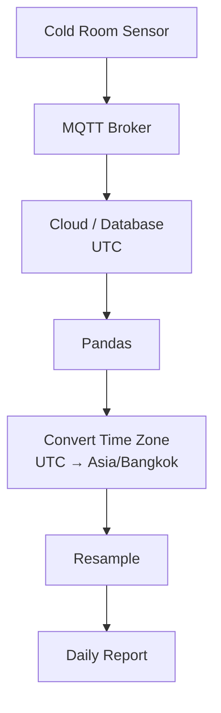
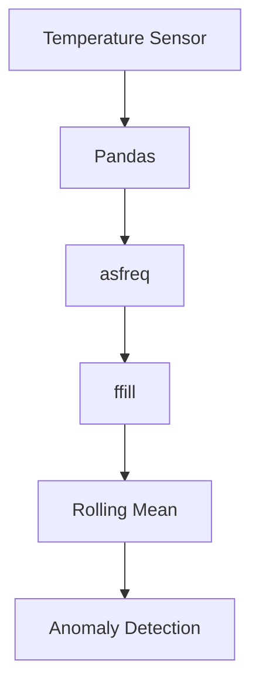

# EP11 — Working with Time Series in Pandas

## เป้าหมายของตอนนี้

เรียนรู้การจัดการข้อมูล Time Series ด้วย Pandas ผ่านตัวอย่าง **Cold Chain Monitoring / Cold Room Monitoring** ซึ่งเหมาะกับงาน Data Engineering และ IoT จริง

หัวข้อหลัก:
- Timestamp
- DatetimeIndex
- `pd.to_datetime()`
- `pd.date_range()`
- Resample
- `asfreq()`
- `ffill()` / `bfill()`
- Rolling
- Shift
- Timedelta
- Time Zone (UTC ↔ Asia/Bangkok)
- Time-based Analytics

---

# 1. Import Library

```python
import pandas as pd
import numpy as np
```

---

# 2. Time Series คืออะไร

Time Series คือข้อมูลที่มีเวลาเป็นแกนหลัก

ตัวอย่าง:

| timestamp | room_id | temperature_c | humidity_percent |
|---|---|---:|---:|
| 2026-01-01 08:00 | room_a | 4.1 | 68 |
| 2026-01-01 09:00 | room_a | 4.3 | 69 |
| 2026-01-01 10:00 | room_a | 4.5 | 70 |

<br>

พบได้บ่อยใน:
- IoT Sensor
- MQTT
- PLC
- SCADA
- InfluxDB
- Cold Room
- Energy Monitoring
- Machine Monitoring

---

# 3. Timestamp

`Timestamp` คือเวลาหนึ่งจุด

```python
t = pd.Timestamp("2026-01-01 08:00:00")
print(t)
```

---

# 4. แปลง String เป็น Datetime

ข้อมูลจาก CSV หรือ Database มักเป็น string ก่อน ต้องแปลงเป็น datetime

```python
df["timestamp"] = pd.to_datetime(df["timestamp"])
```

---

# 5. สร้าง DatetimeIndex

```python
df = df.set_index("timestamp")
```

เมื่อ timestamp เป็น index แล้ว เราจะใช้ความสามารถด้าน Time Series ของ Pandas ได้ง่ายขึ้น

---

# 6. สร้างช่วงเวลาอัตโนมัติด้วย date_range()

```python
pd.date_range(
    start="2026-01-01",
    periods=24,
    freq="H"
)
```

---

# 7. Frequency Codes ที่ใช้บ่อย

| Code | ความหมาย |
|---|---|
| D | Day |
| H | Hour |
| min | Minute |
| S | Second |
| W | Week |
| M | Month |
| Q | Quarter |
| Y | Year |

> หมายเหตุ: ใน Pandas รุ่นใหม่บางเวอร์ชัน อาจแนะนำให้ใช้ `"h"` แทน `"H"` และ `"min"` แทน `"T"`

---

# 8. สร้าง Cold Room Dataset

```python
timestamps = pd.date_range(
    "2026-01-01",
    periods=48,
    freq="H"
)

coldroom = pd.DataFrame({
    "timestamp": timestamps,
    "room_id": ["room_a"] * 48,
    "temperature_c": np.random.uniform(3, 8, 48),
    "humidity_percent": np.random.uniform(60, 80, 48),
    "door_open": np.random.choice([False, True], 48, p=[0.85, 0.15]),
    "compressor_running": np.random.choice([False, True], 48, p=[0.35, 0.65])
})

coldroom = coldroom.set_index("timestamp")

print(coldroom.head())
```

---

# 9. Time-based Indexing

ดึงข้อมูลเฉพาะวัน

```python
print(
    coldroom.loc["2026-01-01"]
)
```

ดึงข้อมูลเฉพาะช่วงเวลา

```python
print(
    coldroom.loc["2026-01-01 08:00":"2026-01-01 12:00"]
)
```

---

# 10. Resample คืออะไร

`resample()` ใช้เปลี่ยนความละเอียดของข้อมูลเวลา พร้อมคำนวณสรุป

ตัวอย่าง:

```text
ข้อมูลรายชั่วโมง → สรุปรายวัน
ข้อมูลรายนาที → สรุปรายชั่วโมง
ข้อมูลราย 15 นาที → สรุปรายวัน
```

---

# 11. Resample Mean

ค่าเฉลี่ยรายวัน

```python
daily_mean = coldroom.resample("D").mean(numeric_only=True)

print(daily_mean)
```

เหมาะกับ:

- temperature_c
- humidity_percent
- power_kw เฉลี่ย
- vibration เฉลี่ย

---

# 12. Resample Max

ค่าสูงสุดรายวัน

```python
daily_max = coldroom.resample("D").max(numeric_only=True)

print(daily_max)
```

เหมาะกับการดูค่าสูงผิดปกติ เช่น อุณหภูมิสูงสุดของห้องเย็นในแต่ละวัน

---

# 13. Resample Sum

นับจำนวนครั้งที่ประตูเปิดในแต่ละวัน

```python
door_open_daily = coldroom["door_open"].resample("D").sum()

print(door_open_daily)
```

เพราะ `True` มีค่าเท่ากับ 1 และ `False` มีค่าเท่ากับ 0

---

# 14. asfreq() คืออะไร

`asfreq()` ใช้เปลี่ยนความถี่ของ index โดยตรง

ต่างจาก `resample()` ตรงที่:

```text
resample() = เปลี่ยนความถี่ + คำนวณสรุป
asfreq()  = เปลี่ยนความถี่แบบเลือกจุดเวลา ไม่ได้ aggregate
```

ตัวอย่างข้อมูลทุก 2 ชั่วโมง

```python
sample = pd.DataFrame({
    "timestamp": pd.date_range(
        "2026-01-01 00:00",
        periods=6,
        freq="2H"
    ),
    "temperature_c": [4.1, 4.3, 4.8, 5.2, 4.9, 4.5]
})

sample = sample.set_index("timestamp")

print(sample)
```

เปลี่ยนให้เป็นข้อมูลทุก 1 ชั่วโมง

```python
hourly = sample.asfreq("H")

print(hourly)
```

จะเห็นว่าชั่วโมงที่ไม่มีข้อมูลจะกลายเป็น `NaN`

---

# 15. ffill() และ bfill()

เมื่อใช้ `asfreq()` แล้วเกิดช่องว่างเวลา Pandas จะใส่ `NaN`

เราสามารถเติมค่าได้ 2 วิธีหลัก:

```text
ffill = forward fill = เติมด้วยค่าก่อนหน้า
bfill = backward fill = เติมด้วยค่าถัดไป
```

---

## Forward Fill

```python
hourly_ffill = sample.asfreq("H").ffill()

print(hourly_ffill)
```

เหมาะกับข้อมูลที่ค่าก่อนหน้าสามารถถือว่ายังคงอยู่ชั่วคราว เช่น:

- status
- compressor_running
- door state
- last known value

---

## Backward Fill

```python
hourly_bfill = sample.asfreq("H").bfill()

print(hourly_bfill)
```

ใช้เมื่อต้องการเติมจากค่าถัดไป แต่ต้องระวัง เพราะอาจทำให้ข้อมูลเหมือนรู้อนาคต

---

## ใช้ method ใน asfreq โดยตรง

```python
hourly_ffill = sample.asfreq("H", method="ffill")

print(hourly_ffill)
```

---

# 16. ข้อควรระวังของ ffill / bfill

อย่าเติมข้อมูลแบบไม่คิด เพราะอาจทำให้การวิเคราะห์ผิด

ตัวอย่าง:

- อุณหภูมิหายไป 6 ชั่วโมง ไม่ควร ffill ทันทีโดยไม่ตรวจสอบ
- Alarm ที่หายไป ไม่ควรเติมเองถ้าไม่รู้สถานะจริง
- ข้อมูลสำหรับ AI อาจเกิด bias ถ้าเติมค่าผิดวิธี

แนวทางที่ดี:

```python
coldroom["temperature_c"].isna().sum()
```

ตรวจสอบจำนวน Missing ก่อนเสมอ

---

# 17. Rolling Mean

Rolling คือการคำนวณแบบหน้าต่างเลื่อน

```python
coldroom["temp_rolling_3h"] = (
    coldroom["temperature_c"]
    .rolling(3)
    .mean()
)

print(coldroom[["temperature_c", "temp_rolling_3h"]].head(10))
```

ใช้ลด Noise ของ Sensor

---

# 18. Rolling 24 ชั่วโมง

```python
coldroom["temp_rolling_24h"] = (
    coldroom["temperature_c"]
    .rolling(24)
    .mean()
)
```

เหมาะกับการดูแนวโน้มรายวัน

---

# 19. Shift

`shift()` ใช้เลื่อนข้อมูล เพื่อเปรียบเทียบกับค่าก่อนหน้า

```python
coldroom["previous_temp"] = (
    coldroom["temperature_c"]
    .shift(1)
)
```

---

# 20. Difference

คำนวณการเปลี่ยนแปลงของอุณหภูมิจากชั่วโมงก่อนหน้า

```python
coldroom["temp_diff"] = (
    coldroom["temperature_c"]
    - coldroom["previous_temp"]
)

print(coldroom[["temperature_c", "previous_temp", "temp_diff"]].head())
```

ใช้ในงาน:

- ตรวจจับการเปลี่ยนแปลงเร็วผิดปกติ
- ดูผลกระทบจากการเปิดประตู
- ตรวจสอบ Compressor behavior

---

# 21. Timedelta

`Timedelta` คือระยะเวลาระหว่างเวลา 2 จุด

```python
start = pd.Timestamp("2026-01-01 08:00")
end = pd.Timestamp("2026-01-01 10:30")

duration = end - start

print(duration)
```

ผลลัพธ์:

```text
0 days 02:30:00
```

---

# 22. Time Zone คืออะไร

ในระบบจริง ข้อมูลจาก Server, Cloud, Database หรือ MQTT อาจเก็บเป็น UTC

แต่เวลาที่ผู้ใช้งานในไทยต้องการดูคือ Asia/Bangkok

```text
UTC
↓
Asia/Bangkok
```

ประเทศไทยอยู่โซนเวลา UTC+7

---

# 23. สร้าง Timestamp แบบ UTC

```python
utc_time = pd.to_datetime(
    "2026-01-01 01:00:00",
    utc=True
)

print(utc_time)
```

ผลลัพธ์จะเป็นเวลาแบบ UTC

---

# 24. แปลง UTC เป็น Asia/Bangkok

```python
bangkok_time = utc_time.tz_convert("Asia/Bangkok")

print(bangkok_time)
```

ถ้า UTC คือ 01:00 เวลาไทยจะเป็น 08:00

---

# 25. Time Zone กับ DataFrame

```python
cloud_logs = pd.DataFrame({
    "timestamp_utc": [
        "2026-01-01 01:00:00",
        "2026-01-01 02:00:00",
        "2026-01-01 03:00:00"
    ],
    "temperature_c": [
        4.1,
        4.3,
        4.8
    ]
})

cloud_logs["timestamp_utc"] = pd.to_datetime(
    cloud_logs["timestamp_utc"],
    utc=True
)

cloud_logs["timestamp_bangkok"] = (
    cloud_logs["timestamp_utc"]
    .dt.tz_convert("Asia/Bangkok")
)

print(cloud_logs)
```

---

# 26. ตั้งเวลาไทยเป็น Index

```python
cloud_logs = cloud_logs.set_index("timestamp_bangkok")

print(cloud_logs)
```

---

# 27. วิเคราะห์ตามชั่วโมง

```python
hourly_avg = coldroom.groupby(
    coldroom.index.hour
).mean(numeric_only=True)

print(hourly_avg)
```

ใช้ดูว่าเวลาใดอุณหภูมิสูงกว่าปกติ

---

# 28. วิเคราะห์ตามวันในสัปดาห์

```python
weekday_avg = coldroom.groupby(
    coldroom.index.dayofweek
).mean(numeric_only=True)

print(weekday_avg)
```

ค่าของ `dayofweek`:

```text
0 = Monday
1 = Tuesday
2 = Wednesday
3 = Thursday
4 = Friday
5 = Saturday
6 = Sunday
```

---

# 29. Anomaly Detection แบบง่าย

หาอุณหภูมิที่สูงกว่า 8°C

```python
high_temp = coldroom[
    coldroom["temperature_c"] > 8
]

print(high_temp)
```

---

# 30. Mini Lab 1 — Daily Cold Room Report

```python
daily_report = coldroom.resample("D").agg({
    "temperature_c": ["mean", "min", "max"],
    "humidity_percent": ["mean", "min", "max"],
    "door_open": "sum",
    "compressor_running": "sum"
})

print(daily_report)
```

---

# 31. Mini Lab 2 — Missing Time Slots

สร้างข้อมูลหายบางช่วง

```python
missing_sample = sample.drop(sample.index[2])

print(missing_sample)
```

บังคับให้กลับมาเป็นข้อมูลทุก 1 ชั่วโมง

```python
fixed_freq = missing_sample.asfreq("H")

print(fixed_freq)
```

เติมค่าด้วย ffill

```python
fixed_ffill = fixed_freq.ffill()

print(fixed_ffill)
```

---

# 32. Mini Lab 3 — UTC to Bangkok

```python
logs = pd.DataFrame({
    "timestamp": [
        "2026-01-01 00:00:00",
        "2026-01-01 01:00:00",
        "2026-01-01 02:00:00"
    ],
    "temperature_c": [
        4.0,
        4.2,
        4.5
    ]
})

logs["timestamp"] = pd.to_datetime(
    logs["timestamp"],
    utc=True
)

logs["timestamp_th"] = (
    logs["timestamp"]
    .dt.tz_convert("Asia/Bangkok")
)

print(logs)
```

---

# 33. Real World Architecture





---

# สิ่งที่ควรเข้าใจหลังเรียนจบ

หลังจาก EP นี้ คุณควรเข้าใจ:

1. `Timestamp`
2. `pd.to_datetime()`
3. `DatetimeIndex`
4. `pd.date_range()`
5. Frequency Code
6. `resample()`
7. `asfreq()`
8. `ffill()` / `bfill()`
9. `rolling()`
10. `shift()`
11. `Timedelta`
12. Time Zone
13. UTC
14. Asia/Bangkok
15. Time-based GroupBy

---

# คำศัพท์สำคัญ

| คำศัพท์ | ความหมาย |
|---|---|
| Timestamp | เวลาหนึ่งจุด |
| DatetimeIndex | index ที่เป็นเวลา |
| Time Series | ข้อมูลที่มีเวลาเป็นแกน |
| Resample | เปลี่ยนความถี่พร้อมคำนวณสรุป |
| asfreq | เปลี่ยนความถี่ของ index |
| ffill | เติมค่าด้วยค่าก่อนหน้า |
| bfill | เติมค่าด้วยค่าถัดไป |
| Rolling | คำนวณแบบหน้าต่างเลื่อน |
| Shift | เลื่อนข้อมูล |
| Timedelta | ระยะเวลาระหว่างเวลา |
| UTC | เวลามาตรฐานสากล |
| Asia/Bangkok | Time Zone ประเทศไทย |

---

# การบ้าน

สร้าง DataFrame ชื่อ `machine_logs` โดยมี column:
- timestamp
- machine_id
- temperature_c
- vibration_mm_s
- status

<br>

จากนั้นให้ทำ:
1. แปลง timestamp ด้วย `pd.to_datetime()`
2. ตั้ง timestamp เป็น index
3. resample รายชั่วโมง
4. ใช้ asfreq เพื่อเช็คช่วงเวลาที่หาย
5. เติม missing ด้วย ffill
6. ทำ rolling mean 3 ชั่วโมง
7. ใช้ shift เพื่อหาความต่างจากค่าก่อนหน้า
8. แปลงเวลา UTC เป็น Asia/Bangkok

---

# ตอนถัดไป

EP12 — High Performance Pandas

เราจะเรียนรู้:
- `eval()`
- `query()`
- การเขียน expression ให้เร็วขึ้น
- การ filter ข้อมูลขนาดใหญ่
