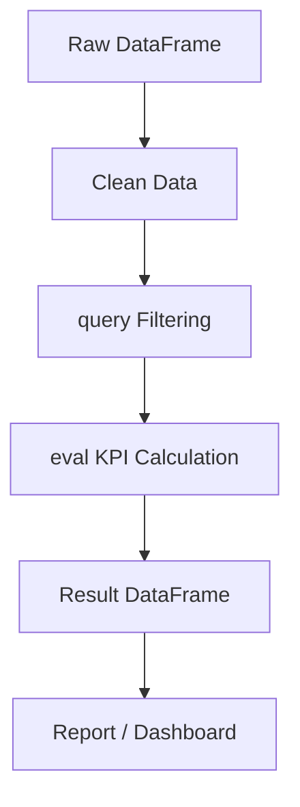
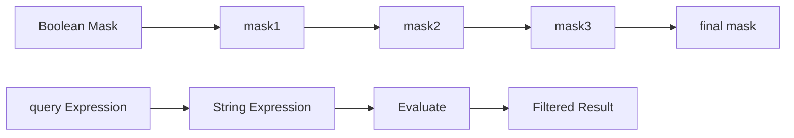

# EP12 — High-Performance Pandas: eval() และ query()

## เป้าหมายของ EP นี้

EP12 จะพาเรียนเรื่อง `eval()` และ `query()` ใน Pandas โดยเน้นการใช้งานจริงสำหรับงาน:
- Data Engineering
- IoT Monitoring
- Industrial Monitoring
- Energy Monitoring
- Cold Room Monitoring
- Manufacturing Analytics
- ETL Pipeline

<br>

แนวคิดหลักของตอนนี้คือ:

```text
เขียนโค้ด Pandas ให้อ่านง่ายขึ้น ลด temporary object ในบางกรณี และช่วยจัดการ expression ที่ซับซ้อนให้อยู่ในรูปแบบที่ดูแลง่าย
```

---

# 1. Import Library

```python
import pandas as pd
import numpy as np
```

---

# 2. ทำไมต้องสนใจ Performance

ในงานจริง DataFrame อาจมีข้อมูลจำนวนมาก เช่น:
- Sensor data ทุก 1 วินาที
- Power meter หลายร้อยตัว
- Machine log หลายล้านแถว
- Cold room log หลายเดือน
- Alarm event จากระบบโรงงาน

<br>

ถ้าเขียนเงื่อนไขหลายชั้น Pandas อาจสร้างข้อมูลชั่วคราวหลายชุดใน RAM ตัวอย่าง:

```python
result = df[
    (df["temperature_c"] > 30) &
    (df["power_kw"] > 10) &
    (df["status"] == "running")
]
```

โค้ดนี้อ่านได้ แต่เมื่อ DataFrame ใหญ่มาก อาจใช้ memory เพิ่มจาก temporary mask หลายตัว

---

# 3. Temporary Object คืออะไร

เมื่อเขียนแบบนี้:

```python
(df["temperature_c"] > 30) & (df["power_kw"] > 10)
```

Pandas จะสร้างผลลัพธ์ชั่วคราวประมาณนี้:

```python
mask1 = df["temperature_c"] > 30
mask2 = df["power_kw"] > 10
final_mask = mask1 & mask2
```

ถ้ามีข้อมูล 5 ล้านแถว mask เหล่านี้ก็มีขนาดใหญ่ตามไปด้วย

---

# 4. eval() และ query() คืออะไร

## eval()

ใช้คำนวณ expression ภายใน DataFrame

เหมาะกับ:
- คำนวณ column ใหม่
- เขียนสูตรที่อ่านง่าย
- ลดความซับซ้อนของ syntax

## query()

ใช้กรองข้อมูลด้วย expression แบบ string

เหมาะกับ:
- Filtering
- หลายเงื่อนไข
- อ่านง่ายกว่า boolean mask

---

# 5. สร้างข้อมูลตัวอย่าง Factory Monitoring

```python
factory = pd.DataFrame({
    "machine_id": ["M01", "M02", "M03", "M04", "M05"],
    "line": ["line_1", "line_1", "line_2", "line_2", "line_3"],
    "temperature_c": [32.5, 28.2, 35.1, 30.8, 33.9],
    "vibration_mm_s": [1.2, 0.8, 2.5, 1.0, 1.8],
    "power_kw": [12.5, 8.2, 15.4, 10.1, 13.2],
    "status": ["running", "idle", "running", "running", "alarm"]
})

print(factory)
```

---

# 6. Boolean Mask แบบปกติ

```python
result = factory[
    (factory["temperature_c"] > 30) &
    (factory["power_kw"] > 10)
]

print(result)
```

แปลว่า:

```text
เลือกเครื่องจักรที่ temperature_c > 30 และ power_kw > 10
```

---

# 7. query() แบบอ่านง่าย

```python
result = factory.query(
    "temperature_c > 30 and power_kw > 10"
)

print(result)
```

ผลลัพธ์จะใกล้เคียงกับ Boolean Mask แต่เขียนอ่านง่ายกว่า

---

# 8. query() กับ String

```python
running = factory.query(
    "status == 'running'"
)

print(running)
```

เลือกเฉพาะเครื่องที่ status เป็น running

---

# 9. query() หลายเงื่อนไข

```python
result = factory.query(
    "status == 'running' and temperature_c > 30 and power_kw > 10"
)

print(result)
```

เหมาะกับงานจริง เช่น:
```text
เครื่องกำลังทำงาน
อุณหภูมิสูง
ใช้ไฟสูง
```

---

# 10. query() กับ or

```python
result = factory.query(
    "status == 'alarm' or temperature_c > 34"
)

print(result)
```

---

# 11. query() กับ Local Variable ด้วย @

```python
temp_limit = 30

result = factory.query(
    "temperature_c > @temp_limit"
)

print(result)
```

`@temp_limit` หมายถึงใช้ตัวแปร Python ภายนอก DataFrame

---

# 12. query() กับหลาย Local Variable

```python
temp_limit = 30
power_limit = 10

result = factory.query(
    "temperature_c > @temp_limit and power_kw > @power_limit"
)

print(result)
```

เหมาะสำหรับ config-based filtering

---

# 13. eval() สำหรับคำนวณ Column ใหม่

```python
factory["load_score"] = factory.eval(
    "temperature_c + power_kw + vibration_mm_s"
)

print(factory)
```

---

# 14. eval() แบบ Assignment

```python
factory.eval(
    "efficiency_score = power_kw / vibration_mm_s",
    inplace=True
)

print(factory)
```

`inplace=True` คือแก้ DataFrame เดิมโดยตรง

---

# 15. eval() แก้ Column เดิม

```python
factory.eval(
    "power_kw = power_kw * 1.05",
    inplace=True
)

print(factory)
```

ตัวอย่างนี้สมมุติปรับค่า power_kw เพิ่ม 5%

---

# 16. eval() กับ Local Variable

```python
factor = 1.1

factory.eval(
    "adjusted_power = power_kw * @factor",
    inplace=True
)

print(factory)
```

---

# 17. pd.eval() กับ DataFrame หลายตัว

```python
df1 = pd.DataFrame({"A": [1, 2, 3]})
df2 = pd.DataFrame({"A": [10, 20, 30]})

result = pd.eval("df1 + df2")

print(result)
```

`pd.eval()` ใช้ expression ระดับบน และอ้างถึงตัวแปร Python ได้

---

# 18. DataFrame.eval() vs pd.eval()

| แบบ | ใช้เมื่อไร |
|---|---|
| `df.eval()` | คำนวณจาก column ภายใน DataFrame |
| `pd.eval()` | คำนวณจาก object หลายตัว เช่น df1 + df2 |
| `df.query()` | ใช้กรอง row |

---

# 19. query() กับชื่อ Column ที่มีช่องว่าง

ถ้า column มีช่องว่าง เช่น `power kw`

```python
df = pd.DataFrame({
    "power kw": [10, 20, 30]
})

df.query("`power kw` > 15")
```

ต้องใช้ backtick:

```text
`power kw`
```

---

# 20. query() กับ Datetime

```python
logs = pd.DataFrame({
    "timestamp": pd.date_range("2026-01-01", periods=5, freq="h"),
    "temperature_c": [4.1, 4.3, 5.0, 6.2, 4.8]
})

start_time = "2026-01-01 02:00:00"

result = logs.query(
    "timestamp >= @start_time"
)

print(result)
```

---

# 21. query() กับ Cold Room Monitoring

```python
coldroom = pd.DataFrame({
    "room_id": ["room_a", "room_a", "room_b", "room_b"],
    "temperature_c": [4.1, 8.5, 3.8, 9.2],
    "door_open": [False, True, False, True],
    "compressor_running": [True, True, True, False]
})

abnormal = coldroom.query(
    "temperature_c > 8 and door_open == True"
)

print(abnormal)
```

---

# 22. query() กับ Energy Monitoring

```python
energy = pd.DataFrame({
    "building": ["A", "A", "B", "B"],
    "energy_kwh": [1200, 900, 1600, 1100],
    "peak_kw": [80, 55, 95, 60]
})

high_energy = energy.query(
    "energy_kwh > 1000 and peak_kw > 70"
)

print(high_energy)
```

---

# 23. query() กับ Manufacturing Data

```python
production = pd.DataFrame({
    "line": ["L1", "L1", "L2", "L2"],
    "output_qty": [1000, 850, 1200, 700],
    "defect_qty": [15, 40, 10, 55]
})

risk = production.query(
    "output_qty < 900 or defect_qty > 50"
)

print(risk)
```

---

# 24. ใช้ eval() สร้าง KPI

```python
production.eval(
    "defect_rate = defect_qty / output_qty * 100",
    inplace=True
)

print(production)
```

---

# 25. query() จาก KPI

```python
high_defect = production.query(
    "defect_rate > 5"
)

print(high_defect)
```

---

# 26. Memory Usage

ตรวจสอบ memory ของ DataFrame

```python
factory.info()
```

หรือ

```python
factory.memory_usage(deep=True)
```

รวม memory ทั้งหมด:

```python
factory.memory_usage(deep=True).sum()
```

---

# 27. Benchmark แบบง่าย

```python
import time

start = time.time()

result = factory.query(
    "temperature_c > 30 and power_kw > 10"
)

end = time.time()

print(end - start)
```

---

# 28. Benchmark กับ Data ขนาดใหญ่

```python
n = 1_000_000

big_df = pd.DataFrame({
    "temperature_c": np.random.uniform(20, 40, n),
    "power_kw": np.random.uniform(5, 20, n),
    "vibration_mm_s": np.random.uniform(0.5, 4.0, n)
})
```

Boolean Mask:

```python
result1 = big_df[
    (big_df["temperature_c"] > 30) &
    (big_df["power_kw"] > 10) &
    (big_df["vibration_mm_s"] < 2.5)
]
```

query():

```python
result2 = big_df.query(
    "temperature_c > 30 and power_kw > 10 and vibration_mm_s < 2.5"
)
```

---

# 29. ตรวจสอบผลลัพธ์ว่าเท่ากันไหม

```python
print(result1.shape)
print(result2.shape)
```

ถ้าอยากเช็คละเอียด:

```python
print(result1.reset_index(drop=True).equals(
    result2.reset_index(drop=True)
))
```

---

# 30. ใช้ engine

Pandas สามารถใช้ engine ได้ เช่น:

```python
big_df.query(
    "temperature_c > 30 and power_kw > 10",
    engine="numexpr"
)
```

<br>

หรือ:

```python
big_df.query(
    "temperature_c > 30 and power_kw > 10",
    engine="python"
)
```

โดยทั่วไปค่า default จะเลือกให้เหมาะสมอยู่แล้ว

---

# 31. numexpr คืออะไร

`numexpr` คือ library ที่ช่วยประมวลผล expression ขนาดใหญ่ได้มีประสิทธิภาพขึ้นในบางกรณี

ติดตั้งได้ด้วย:

```bash
pip install numexpr

# or

sudo apt install python3-numexpr
```

ตรวจสอบ:

```python
import numexpr
print(numexpr.__version__)
```

---

# 32. เมื่อไรควรใช้ query()

ควรใช้เมื่อ:

- เงื่อนไขยาว
- ต้องการให้อ่านง่าย
- Filter ข้อมูลหลายเงื่อนไข
- DataFrame มีขนาดใหญ่
- ต้องการใช้ local variable ด้วย `@`

---

# 33. เมื่อไรควรใช้ eval()

ควรใช้เมื่อ:

- ต้องคำนวณ column ใหม่จากหลาย column
- สูตรยาว
- ต้องการ syntax ที่อ่านง่าย
- ต้องการ assignment ใน DataFrame
- DataFrame มีขนาดใหญ่

---

# 34. เมื่อไรไม่จำเป็นต้องใช้ eval/query

ไม่จำเป็นเมื่อ:

- DataFrame เล็ก
- เงื่อนไขสั้นมาก
- ทีมไม่คุ้นกับ string expression
- ต้องการ debug ทีละขั้นแบบชัดเจน
- มี logic ซับซ้อนที่ query/eval ไม่รองรับ

---

# 35. ข้อควรระวัง

- `query()` และ `eval()` รับ expression เป็น string
- ถ้า column name มีช่องว่างต้องใช้ backtick
- ถ้าใช้ตัวแปร Python ต้องใส่ `@`
- ไม่เหมาะกับ logic ซับซ้อนมาก ๆ
- ต้องระวังชนิดข้อมูล string, datetime, category

---

# 36. Mini Lab 1 — Factory Filtering

```python
factory = pd.DataFrame({
    "machine_id": ["M01", "M02", "M03", "M04", "M05"],
    "temperature_c": [32.5, 28.2, 35.1, 30.8, 33.9],
    "vibration_mm_s": [1.2, 0.8, 2.5, 1.0, 1.8],
    "power_kw": [12.5, 8.2, 15.4, 10.1, 13.2],
    "status": ["running", "idle", "running", "running", "alarm"]
})

result = factory.query(
    "temperature_c > 30 and power_kw > 10"
)

print(result)
```

---

# 37. Mini Lab 2 — KPI ด้วย eval()

```python
factory.eval(
    "risk_score = temperature_c * vibration_mm_s / power_kw",
    inplace=True
)

print(factory)
```

---

# 38. Mini Lab 3 — ใช้ Variable ภายนอก

```python
risk_limit = 5

risk_machine = factory.query(
    "risk_score > @risk_limit"
)

print(risk_machine)
```

---

# 39. Mini Lab 4 — Cold Room Abnormal

```python
coldroom = pd.DataFrame({
    "room_id": ["room_a", "room_a", "room_b", "room_b"],
    "temperature_c": [4.1, 8.5, 3.8, 9.2],
    "door_open": [False, True, False, True],
    "compressor_running": [True, True, True, False]
})

abnormal = coldroom.query(
    "temperature_c > 8 and door_open == True"
)

print(abnormal)
```

---

# 40. Mini Lab 5 — Big Data Benchmark

```python
n = 1_000_000

big_df = pd.DataFrame({
    "temperature_c": np.random.uniform(20, 40, n),
    "power_kw": np.random.uniform(5, 20, n),
    "vibration_mm_s": np.random.uniform(0.5, 4.0, n)
})

result = big_df.query(
    "temperature_c > 30 and power_kw > 10 and vibration_mm_s < 2.5"
)

print(result.head())
print(result.shape)
```

---

# 41. eval/query Workflow



---

# 42. Boolean Mask vs query



---

# Best Practice

- ใช้ `query()` เมื่อ filter หลายเงื่อนไข
- ใช้ `eval()` เมื่อคำนวณ column จาก expression
- ใช้ `@` สำหรับค่าที่มาจาก variable ภายนอก
- ใช้ backtick เมื่อ column name มีช่องว่าง
- ใช้ `.copy()` เมื่อจะนำผลลัพธ์ไปแก้ไขต่อ
- ตรวจสอบผลลัพธ์ด้วย `.shape`, `.head()`, `.info()`

---

# สิ่งที่ควรเข้าใจหลังเรียนจบ

1. `query()` ใช้ filter row
2. `eval()` ใช้คำนวณ expression
3. `@variable` ใช้ดึงตัวแปร Python เข้า expression
4. Boolean Mask กับ query ให้ผลลัพธ์ใกล้เคียงกัน
5. `eval()` สร้าง column ใหม่ได้
6. `query()` ช่วยให้อ่านเงื่อนไขง่ายขึ้น
7. ข้อมูลเล็กไม่จำเป็นต้องเร็วกว่าเสมอ
8. จุดเด่นหลักคือ readability และ memory ในบางกรณี
9. ระวัง column name ที่มีช่องว่าง
10. เหมาะกับ Data Engineering Pipeline

---

# Quiz

1. `query()` ใช้ทำอะไร?
2. `eval()` ใช้ทำอะไร?
3. ถ้าต้องการใช้ตัวแปร Python ใน query ต้องใส่อะไร?
4. ถ้า column name มีช่องว่าง ต้องเขียนอย่างไร?
5. Boolean Mask ต่างจาก query อย่างไร?
6. eval() สามารถสร้าง column ใหม่ได้ไหม?
7. DataFrame เล็กควรใช้ eval/query เสมอหรือไม่?
8. numexpr เกี่ยวข้องกับ eval/query อย่างไร?

---

# 47. Challenge

ใช้ dataset `factory_monitoring.csv`

ให้ทำ:
1. อ่าน CSV ด้วย `pd.read_csv()`
2. ใช้ `query()` เลือกเครื่องที่ `temperature_c > 33`
3. ใช้ `query()` เลือกเครื่องที่ `status == "running"`
4. ใช้ `eval()` สร้าง `risk_score`
5. ใช้ `query()` เลือก `risk_score > 5`
6. ใช้ `memory_usage()` ตรวจสอบ memory
7. เปรียบเทียบ Boolean Mask กับ query

---

# 48. ตอนถัดไป


`EP13 — Further Resources`

หัวข้อที่ควรต่อยอด:
- Pandas Documentation
- NumPy
- Matplotlib
- Seaborn
- Polars
- DuckDB
- PyArrow
- Dask
- Data Engineering Pipeline
